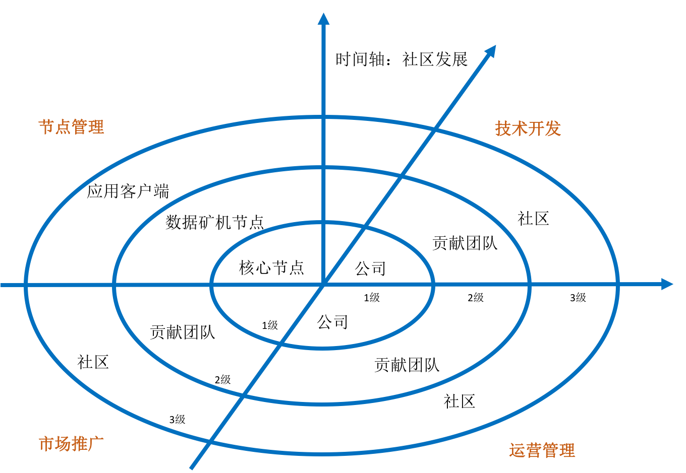

DDN白皮书
-------
——面向企业的区块链系统

v0.0.3

作者：朱志文 石后业 cob 韦坚
2018年1月28日

（本白皮书仍在持续修改完善中...）

## 目录

- [1.概要](#1-概要)
- [2.名词解释](#2-名词解释)
- [3.背景](#3-背景)
    * [3.1 互联网的初衷是资源互联](#31-互联网的初衷是资源互联)
    * [3.2 区块链概念和基本原理](#32-区块链概念和基本原理)
    * [3.3 企业组织的未来形态](#33-区块链概念和原理)

- [4. 基础架构](#4-基础架构)
    * [4.1 DDN的基本架构](#41-DDN的基本架构)
    * [4.2 DDN的优势](#42-DDN的优势)

- [5. 核心技术](#5-核心技术)
    * [5.1 DDN区块链](#51-ddn区块链)
        * [5.1.1 共识机制](#511-共识机制)
        * [5.1.2 受托人](#512-受托人)
        * [5.1.3 点对点网络](#513-点对点网络)
    * [5.2 侧链技术](#52-侧链技术)
        * [5.2.1 虚拟机](#521-虚拟机)
        * [5.2.2 Dapp 开发](#522-dapp开发)
        * [5.2.3 Dapp 运算](#523-dapp运算)
        * [5.2.4 Dapp 共识算法](#524-dapp共识算法)
        * [5.2.5 Dapp 主节点](#525-dapp主节点)
    * [5.3 跨链技术](#53-跨链技术)
        * [5.3.1 具名路由](#531-具名路由)
        * [5.3.2 智能网盘](#532-智能网盘)
    * [5.4 智能合约](#54-智能合约)
    * [5.5 移动钱包](#55-移动钱包)
    * [5.6 模块化](#56-模块化)
    * [5.7 可视化](#57-可视化)
* [6. 商业布局](#6-商业布局)
    * [6.1 应用前景](#61-应用前景)
        * [6.1.1 知识产权保护](#611-知识产权保护)
        * [6.1.2 大数据管理](#612-大数据管理)
        * [6.1.3 物联网](#614-物联网)
        * [6.1.4 健康医疗](#614-健康医疗)
        * [6.1.5 政务管理](#615-政务管理)
        * [6.1.6 金融保险](#616-金融保险)
        * [6.1.7 企业管理](#617-企业管理)
    * [6.2 典型案例](#62-典型案例)
        * [6.2.1 DDN](#621-ddn)
        * [6.2.2 LimsChain](#622-limschain)
        * [6.2.3 艺术品管理系统](#623-艺术品管理系统)
    * [6.3 技术孵化](#63-技术孵化)
    * [6.4 自治社区](#64-自治社区)
    * [6.5 宣传推广](#65-宣传推广)
- [7. 路线图(待)](#7-路线图(待))
    * [7.1 第一阶段](#71-第一阶段)
    * [7.2 第二阶段](#71-第二阶段)
    * [7.3 第三阶段](#71-第三阶段)
* [参考资料](#参考资料)

## 1. 概要
DDN，英文“Data Delivery Network”的简称，是新一代数据分发网络，其使命是“让个人数据更具价值”，立足个人数据存证，保护个人隐私，同时帮助企业改造升级，实现企业高度自治，帮助企业实现“去中心、去组织、去管理”的自治状态。DDN网络基于区块链，从网络寻址、负载均衡、数据分发等各个环节，根据网络流量、各节点的连接、负载状况，以及到用户的距离、响应时间等综合信息，实时地将用户的请求重新导向离用户最近的服务节点上，从而避开互联网上有可能影响数据传输速度和稳定性的瓶颈与环节，使数据传输的更快、更稳定，同时基于区块链公开、透明、可追溯的特点，有效保护用户隐私和数据，具备数据存证、知识变现、流程改造等诸多优点。本白皮书描述了DDN的概念和由来，分析了当前互联网存在的问题，整理了DDN解决的痛点，提出了具体的解决方案，并从商业层面，提出了未来推进的路线图。

## 2. 名词

**Data Delivery Network**，DDN，数据分发网络，充分利用区块链技术进行存储、索引、检索和寻址，实时地将一端用户的数据快速准确传输到另一端用户，从而最大限度地避开基于TCP/IP网络的限制，使数据传输更安全、更准确、更快速。

**Directional Data**，DD，定向数据，DDN网络中传输的数据，包含传统网络中的任何形式，数字、文本、图片、音视频等，区别于传统网络的是，这些数据通过区块链存证功能，从诞生开始就有了权属，未来的转移会被完整记录，有始有终。

**Data Transaction**，DT，数据交易，数据在DDN网络中的每一步流转，都是一次交易行为。我们认为，在数字世界，任何数字形式的变更或转移，都应该有价值呈现或转移，因此DDN是一个价值网络，倡导每一次数据交易都需要付费。

**Data Addressing Protocol**，DAP，数据寻址协议，基于区块链的DNS协议，有效避开传统互联网的寻址方式，快速定位数据来源，并提供最近访问节点。

**Data Storage Protocol**，DSP，数据存储协议，基于P2P网络的数据存储方式，保证了数据存储的安全、便捷，以及提取数据的快速。

**Data Delivery Protocol**，DDP，数据点对点分发协议，区别于CDN那种基于中心化的服务器分散式分发的方式，DDN基于P2P网络，可以做到点对点分发，既保证访问的速度，也可保证不被泄露，从而更安全。
## 3. 背景

DDN要成为现有互联网的根基。
### 3.1 互联网的初衷是资源互联

Tim Berners-Lee是万维网的发明人，被称为“万维网之父”，他反复重申WWW的初衷是作为创意和效率的工具，提供使用者更好的共事与资讯获取的交流环境，更直白的表述就是一个资源互联的网络，其本质就是开放（Open）与去中心化（Decentralized）。

但目前，随着WWW商业化的程度越来越高，基于商业目的，很多产品互相竞争与阻隔，资源互联成为商业掠夺的圣地，一个个数据霸主诞生，中心化的趋势越来越高，开放、互联、效率与创始者的初衷背道而驰，让创始者始料未及，十分遗憾。

另一方面，一个根本的问题始终没有解决，那就是用户的数据一旦进入互联网，便不再属于用户。用户的个人数据，特别是用户创造的数据都是有价值的，因为在现有的互联网上很难确权、授权和维权，便得不到保护。比如：用户撰写的文案、小说、剧本，拍摄的美丽图片，制作的影视作品等，都价值不菲，一旦放到互联网上，便被盗版或转载。

DDN网络，将彻底改变这一现状，通过DDN区块链技术，让用户（个人或企业）数据“数有所属”，进而做到“数有所值”，为个人创富做好基础，最大程度保护用户个人权益，提高企业价值。

### 3.2 区块链的核心是利益转移规则

从技术角度理解，区块链是“一种分布式账本”。更具体一些，区块链是一个基于P2P网络、使用密码学算法开发而成的公开、透明、不可篡改的公共记账系统。一是基于P2P网络。意味着它是一种去中心化的、分布式的。二是密码学算法。指的是每一个交易，每一项内容都会通过哈希计算进行加密，公开的是已被加密的数据，透明的是这些交易行为，对于已完成的交易是不可篡改的。三是公共记账系统。解决了传统一个人的记账行为的问题，人人都有一本账，保证了数据的真实性、可靠性。

从经济学角度理解，区块链是“利益转移规则的编码技术”。其中包含四个关键词，一是利益。不是价值，价值可以理解为蕴含在物品中的、不以人的意志为转移的东西，而利益则可以改变和转移。二是转移。即交易。在区块链上，无论是点对点支付，还是一些数据的保存，都可以抽象为一种交易，都是交易的一种形式。三是规则。比如各种奖励机制，就充分利用了人是趋利的，会追求利益最大化这个基本的经济学原理。四是编码技术。区块链是一项技术，不带有任何政治色彩，也没有任何好坏之分，所谓的去中心化，用在普通人手里就是民主自由化，用在政府手里就是高度集中化，完全由使用者角色和编码规则决定。

DDN网络会设定自身的规则，比如：DDN智能网盘，会根据使用者存储文件、图片、视频等空间使用大小，获得相应的报酬；会根据用户上网时贡献的带宽，获得相应的报酬。同时，也会结合具体的业务场景设定一些规则，比如：亿书产品会对用户撰写的文章进行奖励，作者可以对自己撰写的作品进行定价；社区链会让企业降低大量成本进行推广和运营；Lims系统会让政府监管更加全面高效。
### 3.3 企业的最终形态是高度自治

DDN坚信未来的世界里，基于区块链的企业将高度自治。所以，DDN的愿景是：帮助企业实现“去中心、去组织、去管理”，实现组织自治。反过来说，就是帮助个人这个小中心实现“组织化、资产化、价值化”。

人类社会自有企业组织形态以来，企业的首要目标是利润，但企业获得的利润绝大部分都是被企业所有人享有，而组成企业的分子——企业各职能岗位人员很少分享到，这其中当然有贡献大小的区别，但更重要的是组织形态决定的，因此企业的生命周期往往难以久长。

DDN的首要目标是永续，不仅是要历经十年百年依然存在，而希望能像中华民族一样历经五千年风霜依然屹立于世界，在延续中不断完善自身，同时影响世界发展进步。DDN期望创建这样一个生态：系统内每一分子都能安身安心，各尽所长并各得其所，个体独立自由平等，信息互联和资源共享，理想和使命高度一致，就像一个物种，每一个体在诞生之始就已被注入了追求整体永续的基因，但他也拥有自己独立完整的生活以及完全自主的丰富美好的人生。

DDN社区将作为一种新的组织形态引领企业组织形态的变革发展，成为未来的旗帜。首先，企业应是一种有生命力的有机体，有机体的天性就是首要追求基因延续，因此未来的企业必将以永续经营为首要目标，如追求利润和永续经营有冲突时，未来企业将毫无疑问会放弃利润而选择保障永续。其次，独立自由平等的原则更符合组织个体的切身利益，而每一个体也始终能意识到只有当整体强大并能延续时个体切身利益才有可能得到有力保障，皮之不存毛将焉附。另外，去中心化利于激活组织内自动生态平衡和自我代谢的机制，每一个体间相互依存也相互竞争，没有谁是不可替代的，当有人更适合担当某个角色时就自动实现代谢，始终保持更新的活力。

## 4. 基础架构

### 4.1 DDN的基本架构

DDN网络以区块链节点服务器为核心组成。整个网络由多条区块链组成，每条区块链由多于101个节点服务器构成，整个网络的节点服务器的数量远大于 N*101（N为区块链数量）。这些节点服务器自带负载均衡能力。用户提供IP和请求数据的URL，每个节点都会承担均衡器的角色，把就近的节点服务器提供给用户，最后把用户请求的URL内容返回给用户。基本架构如图：

关键技术包括：

数据存储：区块链技术，通过DPOS共识算法，构建健壮安全的P2P网络；基于P2P网络存储文字、图片、音视频等重要内容，并使用分布式协议提供用户浏览。

数据路由：网络负载均衡技术，根据自身负载综合调度和分配用户请求到附近网络，最终为用户提供最近节点；

数据交换：根据数据特征，直接对区块链进行具名检索，快速获得对应的内容；

性能管理：服务器节点自我诊断，自我管理，即时监测网络变化，踢出停机节点，保证网络整体性能和最佳运行状态。

### 4.2 DDN的优势

**即时应用，无缓存**，DDN网络是即时应用，极少用到缓存，只有在用户客户端开启的那一刻，会将请求数据的最近资源列表或内容缓存，以获得极致体验，其他时候都是即时为主，内容时刻都是最新的。

**适用范围更广**，DDN面向的可以是用户个人生产发布的各类数据，也可以是企业用户构建的大型网站，只要涉及到各类交易和授权操作，都可以与DDN网络进行交互。 

**成本更加低廉**，DDN即时、快速、高效、简单的特点，基于DDN用户可以非常简单的构建自己的去中心化网站、博客、电子商务网站等平台，使用和体验相同的情况下，成本几乎为“0”。
## 5. 核心技术

DDN技术的核心内容包括DDN区块链、跨链技术、侧链技术、智能合约、智能硬件等。
### 5.1 DDN区块链

#### 5.1.1 共识机制

DDN基于DPOS[11](授权股权证明机制)共识算法。DPOS 是由受托人来创建区块。受托人是被社区选举的可信帐户，得票数排行前101位。其它得票排名未进入前101名的受托人帐号被列为候选人，为了成为正式受托人，用户要去社区拉票，获得足够多用户的信任。用户根据自己持有的DDN数量占总量的百分比来投票。当101个区块生成周期完成后，受托人排名前101名的代表就会重新调整，排名下降的则被降级到候选人。每个周期的101个区块均由 101 个代表随机生成，每个块的时间为 10 秒，新创建的块被广播到网络上，并被添加 到区块链里，在得到 6-10 个确认后，交易则被确认，一个完整的 101 个块的周期大概需要 16 分钟。

#### 5.1.2 受托人

想成为受托人，用户需要注册受托人帐户，可以通过任意版本的客户端进行注册，使用全节点程序来开启锻造区块的功能。所有DDN帐户都可以注册成为受托人。新的受托人都是从候选人开始的。候选人从得票率 0 开始，候选人必须到社区拉票，以使自己能挤身前 101 个受托人。注册为受托人要支付一定的网络手续费。

#### 5.1.3 点对点网络

DDN使用的是一个建立在 HTTP 协议之上的标准的对等网络(P2P 网络)，它使用 JSON 进行数据通信，P2P 模块包含了系统版本、IP、端口号等节点数据。 
### 5.2 侧链技术

DDN区块链具备强大、易用、可编程的侧链(Sidechains[14])，可为第三方开发者DD提供简单快捷的扩展服务，开发设计出D个性化的 Dapps。主要特点是:
#### 5.2.1 虚拟机

DDN区块链采取沙箱机制，通过虚拟机来运行未经验证的 JavaScript 代码。该虚拟机是一个 Node.js 的分支，通过 API 与DDN区块链主链进行连接。

Dapp 在虚拟机中运行，使用DDN的算法做为它的共识算法，这种机制能够阻止许多可能的攻击，使用户更加安全的在本机运行 Dapp。用户可以在客户端上运行 Dapps。

#### 5.2.2 Dapp开发

DDN区块链虚拟机 API 简单易用，开发者可以选择任何 NPM 库[15]，使用所有 JavaScript 的异步编程能力，构建基于DDN的任何应用代码。

#### 5.2.3 Dapp运算

DDN实现了一个可依时间计费的系统，DDN虚拟机可以追踪运行一个 Dapp 所使用的 CPU 时间，因此，节点所有者可以通过运行 Dapp 主节点来赚取 DDN 或者 BTC 作为收益。DDN鼓励节点所有者通过提供 CPU 计算，内存，存储和其它资源来获取报酬，促进DDN网络覆盖面更广、更强大、更安全。

#### 5.2.4 Dapp共识算法

Dapp 的所有者可以跟踪自己的 Dapp 被使用的情况。Dapps 内的交易是由主节点处理的， 主节点是由 Dapps 所有者运行的，Dapp 所有者必须拥有一个DDN帐号，这个帐号类似多重签名帐号，它的主要任务是在 Dapp 主节点创建共识并签名新的区块。一旦一个新的 Dapp 区块被创建，并且在主节点内被签名，这个区块需要被转换成 SHA256 哈希。然后 Dapp 所有 者提交这个哈希值给DDN区块链，DDN则存储该哈希值为 Dapp 区块。一旦DDN区块链收到 一条包含Dapp哈希值的交易，就经由受托人对比这条哈希值与上一个啥希值，并将它保存。

#### 5.2.5 Dapp主节点

Dapp 主节点是指安装了该 Dapp 并且针对该 Dapp 开放了区块创建功能的DDN节点，只有多重签名 Dapp 帐户的所有者可以通过使用密钥来运行主节点，主节点是该 Dapp 系统的核心，主节点处理交易并且创建新区块，然后由DDN区块链或者比特币的区块链来保证其安全性。

### 5.3 跨链技术

侧链是对单独一条链的扩展，是锚定在某条主链之上的一个应用，主链消失，侧链也将不再存在。但是面对不同的业务场景，DDN区块链可以快速衍生出新的主链，多条主链之间没有主侧之分，互不影响，某一条链消失不会影响另一条链的存在，数据也不会受到任何影响。为了实现多条链的互访，DDN网络将推出跨链技术，把跨链进一步延伸。基本原理如图所示：

### 5.3.1 具名路由

DDN网络由多条DDN区块链组成，具名路由对整个网络有效。分布式网络、智能寻址、资产化等是DDN网络的基本组成部分，具名路由可以将这些有效关联起来，简化用户操作，提高索引效率和检索速度。具名路由会把用户资产、区块链、数据和资源URL有效统一起来，在节点负载均衡、智能寻址的基础上，实现完整的超越CDN的完美体验。

### 5.3.2 智能网盘 

DDN网络的演进和发展需要一定的过程，用户对个人数据存储的需求多种多样，为了弥补发展过程中，节点部署慢、分布不均匀等弊端，满足用户更多的个性化需求，DDN将进一步完善分布式存储算法，提高分布式网络使用体验；进一步优化文件存储协议，提高存储效率和安全性；推出数据矿机、智能网盘等硬件设备，提高个人存证安全性；通过硬件补偿，增加更多网络节点，增强DDN网络寻址效率。

#### 5.4 智能合约

区块链对智能合约的支持是多样化的。DDN的侧链技术安全、稳定，可以支持更多的Dapp的开发，实现相对复杂的智能合约逻辑，但是对使用者要求较高，需要具备一定的技术能力。因此，未来将添加一个对代码合约的直接支持，让用户针对某些场景，通过定制即可产生一段可运行的智能合约代码，从而降低智能合约使用难度，提高DDN使用的范围，特别是对未来物联网的支持更加简单、广泛。
#### 5.5 移动钱包

DDN提供了PC端的钱包设计，把钱包功能融入了产品之中，下一步将单独提供钱包功能，覆盖PC端和移动端，让用户对资产的管理更加方便，让开发者对钱包功能的集成使用更加简单直接。

#### 5.6 模块化

在技术研发上，DDN将把核心功能进一步细化，拆分成一个个独立的 NPM 包，让协作开发更加高效，让更多开发者更方便的集成DDN网络。进一步添加用户管理模块、KYC认证模块、权限管理模块、流程操作模块、智能合约定制模块等具体的业务模块。

### 5.7 可视化

DDN区块链由无数条公链、私链和联盟链组成，节点数量众多，管理、监控、维护是一项极为挑战性的工作，为了确保整个网络的安全高效，必须实现节点的自我管理，同时提高节点所有者对节点的管控，并在可视化部署和管理上做到极致；针对不同的业务场景，提供可视化的组合操作，用户只要结合自身需要，就能轻松组合成一个完整的DDN区块链产品。同时，不排除使用更多的协议扩展核心P2P网络。

## 6. 商业布局

DDN的目标是从互联网的底层开始，打造下一代价值互联网，让区块链的部署“0”成本。DDN单链部署的简化，链链之间的互访，以及侧链的扩展能力，为商业上的快速扩张奠定了良好基础。

目前，DDN已经与DDN、LimsChain、艺术品管理系统等产品方签约，在文字、影视、艺术品等文娱行业全面布局，在物联网、医疗、金融、供应链等领域全面展开，规模化的生态系统初见规模。

### 6.1 应用前景
#### 6.1.1 知识产权保护

文字、图片、视频、软件著作等数字媒体和资产的版权保护一直是世界难题。确权难、盗版泛滥、取证难等诸多问题困扰业界。“区块链”的优势在于公开透明、防篡改、不可逆等，DDN基金会独创版权协议和版权历史记录，可以为创作者、出版机构等提供“一键注册”的快捷确权服务，“智能检索”的版权取证服务，保险理赔等版权诉讼服务。

### 6.1.2 大数据管理

区块链是分布式账本，更是天生的大数据管理平台，DDN基金会的矩阵链更是把这种大数据的理解完整的渗透其中。当前的世界，所有的人工智能、创新和价值无不是来自于数据和信息。数据和信息在哪里，价值和创新就再哪里诞生。区块链是互联网的未来，必将重构大数据，成为未来一切数据的入口。区块链为大数据搜集、整理和分析，提供了便利、降低了成本、提高了效率。DDN基金会可以为一些大数据公司提供底层技术支持。

### 6.1.3 物联网 

区块链是价值互联和流程控制最好的编码技术。当应用于物联网时，区块链的概念开辟了创新的无限可能性，区块链技术可以被使用于追踪设备的使用历史，可以协调处理设备与设备之间的交易，甚至类似于神经网络，基于区块链智能合约控制设备的运行状态，物联网便成了智能网。DDN基金会研发的底层矩阵链，可以适应大型物联网络，控制管理大量的物理设备，为各类生产企业研发强大的设备管理系统，为光伏发电等精准扶贫项目提供完整的解方案。

### 6.1.4 健康医疗 

基于区块链技术可实现分布式电子病历管理系统，永久保存，不可篡改，在保护隐私的基础上，实现跨机构、跨地域地访问，进而实现医疗信息全面追踪，医疗质量提高，医疗成本下降，患者就医便利性提高，医患关系改善，医疗科研水平提升。在此基础上，DDN基金会区块链网络可扩展应用于政府监管、临床试验、药品流通、健康大数据的挖掘等多种医疗应用场景。DDN基金会可以为相关的企业、医疗机构或政府部门提供相应的技术支持和服务。

### 6.1.5 政务管理 

区块链系统是分布式去中心化的，很难被监管，但是反过来却可以有效解决集中管理中的腐败等问题，甚至可以把原本通过人力无法管理的事情纳入管理之中，从而扩大政府管控的力度。DDN基金会区块链网络提供可信身份认证、数据安全存储、防伪溯源、隐私保护等功能服务，基于矩阵链，可以实现税务监察系统，真实记录和掌握每个纳税对象的纳税情况；可以实现全民共享的个人身份认证系统，真实记录公民身份信息，在各部门、企业间共享，降低成本、提高效率、增强互信；可以实现精准扶贫等。总之，DDN基金会可以协助政府部门，梳理流程、改革升级，从而提升服务水平，塑造良好形象。

### 6.1.6 金融保险 

区块链天生就是一个结算系统，DDN基金会可以为商业银行、企业、大型商业机构等提供区块链数字票据服务，在票据业务中发挥区块链不可篡改、可追溯、实时清算的优势，降低票据清算出现错误的风险和信任成本，追踪资金流向，增强金融监管。

### 6.1.7 企业管理 

区块链的数据不可篡改和可追溯性，在企业供应链管理、人力资源管理、财务管理等方面有着天然的硬需求，DDN作为矩阵链的设计者，可为各大中小企业搭建自己的企业数据链，并在同一行业内不同企业间、及跨行业间实现跨链数据交互，让企业管理更高效，成本更低。

##  6.2 典型案例

### 6.2.1 亿书

DDN，是DDN数据分发网络下最典型的应用。其目标是实现在保护个人隐私的基础上，让用户的知识、创意和数据自由分发并直接变现；围绕文娱产业，实现聚合知识创作、知识付费、数字出版等在内的全经济生态。

###  6.2.2 LimsChain

谷粒LIMS系统，是一个基于区块链技术的、去中心化的、以实验室信息管理为依托的安全信息平台。谷粒，致力于为检测机构的取样，检验，报告，质控，管理全流程、全方位的提供系统的解决方案，提高检测机构效率，降低运营成本，使检测机构实现检验过程及数据的公平、公正、可信任、可追溯。
### 6.2.3 艺术品管理系统
⽬前，DDN已经与大型机构签约，应用区块链技术开发艺术品管理系统。

### 6.3 技术孵化

接下来，DDN将采取技术孵化的模式，进一步加快推进。任何一家从事对区块略有需求的实体，只要具备优质的资源和较强的运营能力，就可以采取如下方式为得到DDN的技术支持和服务：

* 质押锁仓不超过10%的DDN（这块说的不是太清楚是总量的10%吗？）
* 支付同比例的新数字资产作为技术服务费用；
* 从DDN全球社区和学员中招募人才组建维护和开发团队，或者组建专业团队，DDN提供技术培训。

更多其他事宜，视需求不同具体商讨。

### 6.4 自治社区

DDN全球社区建设的目标是“**无中心、无组织、无管理**”（“三无”目标），规则来自于全球社区，管理通过专用的社区链管理系统进行，5年内实现社区管理自治，不受团队、企业或项目方等任何参与者左右。

修改完善推出DDN社区管理《绿皮书》正式版，面向全球招募开发、运营、管理和翻译团队，正在孵化一个社区链管理系统（一个全新的区块链项目），DDN社区将会是这一项目的首个接入社区。社区会利用该系统将DDN技术研发、运营管理等各项工作任务都要写入区块链，并以区块链的运作方式来完成DDN贡献者的奖励与激励。

DDN社区需要各种类型的人才，只要你相信付出自有回报的公平，只要你向往平等互惠的民主，只要你热爱共享共赢的自由，那就请加入DDN社区，这里自然有你发挥所长的地方。

DDN社区按功能划分为节点管理、技术开发、运营管理、市场推广4个子板块，每个板块按贡献大小分为3个等级（或5个等级），等级也对应了社区管理权限和奖励大小，时间轴是社区发展过程中因规模、外部环境等因素变化时需及时调整更新组织架构的组织维度，组织架构的更新按时间戳记录写入区块链中，让社区组织实现自我更新功能。

### 6.3 宣传推广

* 组织行业会议

联合DDN孵化的合作企业或行业内的企业，共同组织各类专业的行业会议，宣传推广DDN落地方案，打造更多落地应用，催生更多优质的IP或企业，让DDN的各链都成为货真价实的资产链，让链上资产更具价值。

* 组织技术研讨

继续定期组织区块链茶座、区块链极客论坛等属于DDN的活动品牌，普及区块链知识和理念，传播技术落地的经验，一起探讨未来方向，研究解决方案，面向未来不断升级DDN各项技术，让DDN始终保持行业领先地位。

* 做好技术培训

DDN已与国内知名的线上培训机构达成战略合作，将对DDN链及其应用等进行系统培训，为行业，特别是合作伙伴提供紧缺的区块链研发人才。用DDN培养人才，用人才服务企业，让企业低成本使用区块链。

## 7.路线图(待)

### 7.1 第一阶段

优化DDN现有代码，提高性能和稳定性；宣传推广DDN，打造国际化社区；

### 7.2 第二阶段

升级DDN核心链，连通其他各链，建成面向全球的数据分发网络；

### 7.3 第三阶段

基于DDN研发各类商业模式，让DDN全面服务人类生活，实现“三无”目标，DDN团队最终淡出或淹没在社区中。而DDN将会伴随着社区成长来实现自己每一次的升级迭代并茁壮成长。

## 参考资料

* [DDN白皮书](http://ddn.link/static/download/ebookchain.pdf)
* [Tim Berners-Lee](https://baike.baidu.com/item/蒂姆·伯纳斯·李/8868412?fr=aladdin)
* [历史上第一个网站](http://info.cern.ch)
* [The birth of the web](https://home.cern/topics/birth-web)
* [NPM 官网](https://www.npmjs.com/)
* [Bitcoin 白皮书](https://bitcoin.org/bitcoin.pdf)
